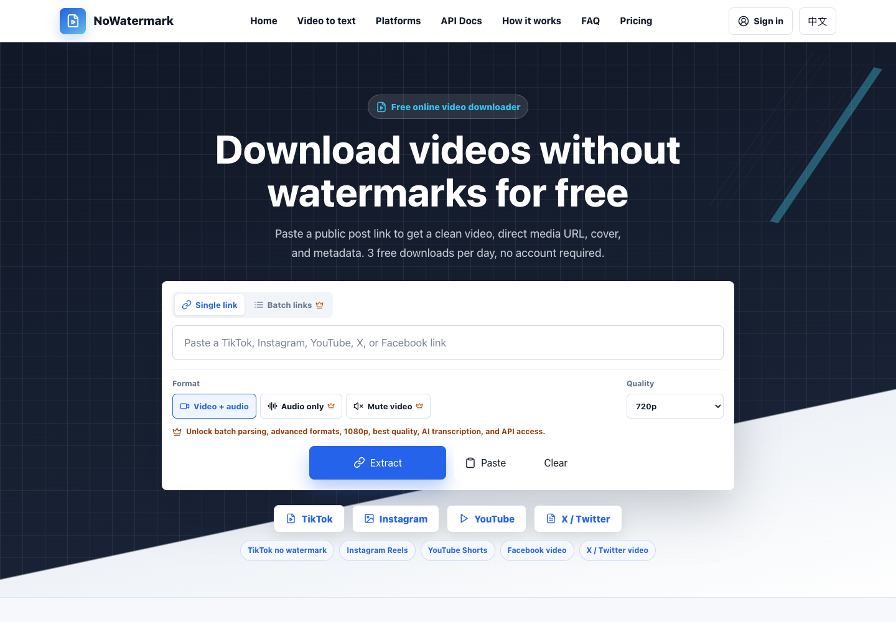
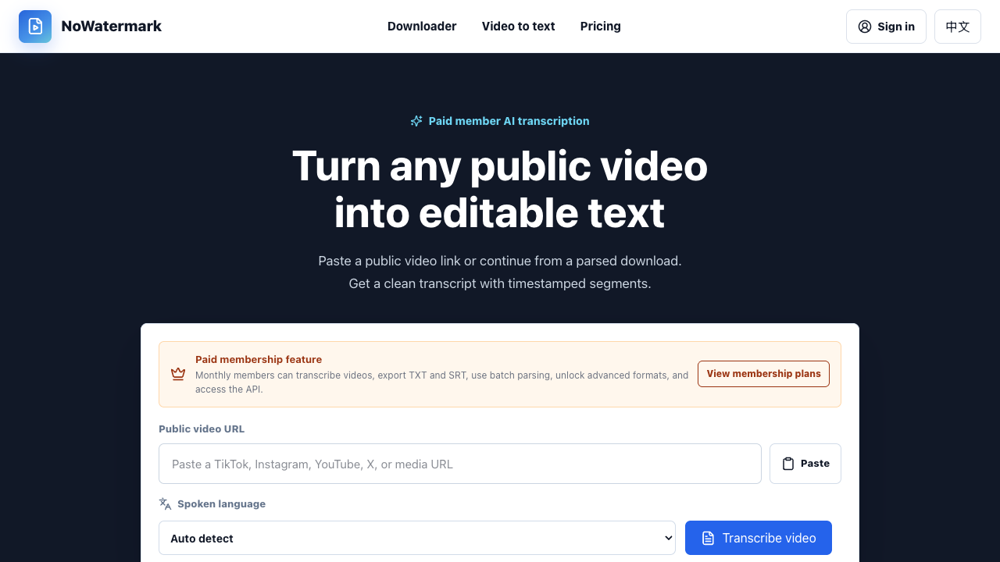

# NoWatermark Downloader：一个链接，完成视频解析、下载与转文字

短视频素材越来越多，但真正要保存、整理或二次创作时，常常要在多个工具之间来回切换：先找解析器，再单独提取音频，最后还得寻找转写工具。

[NoWatermark Downloader](https://nowatermarkdownloader.com/) 把这些步骤放进了一个清晰的在线工作流。粘贴公开视频链接，就可以解析可下载的视频资源；需要进一步处理时，还能继续完成音频导出、批量解析和视频转文字。

> 无需安装软件。免费基础解析无需注册，每日可使用 3 次。

[立即解析视频](https://nowatermarkdownloader.com/) · [体验视频转文字](https://nowatermarkdownloader.com/transcribe) · [查看 API 文档](https://nowatermarkdownloader.com/api-docs)

## 它是什么？

NoWatermark Downloader 是一个面向海外公开短视频链接的在线解析工具。它支持 TikTok、Instagram、YouTube、X / Twitter、Facebook 等常见平台，并可返回干净的视频资源、媒体直链、封面和基础元数据。

解析服务并不只依赖单一节点：主解析服务失败时，系统会自动尝试健康的备用服务，提高公开链接的可用性。平台规则、内容权限或源视频状态仍可能影响最终结果。

## 从一次下载，到完整的创作者工作流

| 能力                 |     免费基础版      |   月度会员    |
| -------------------- | :-----------------: | :-----------: |
| 单条公开视频解析     | 每日 3 次，无需登录 |     支持      |
| 480P / 720P 下载     |        支持         |     支持      |
| 批量解析             |          -          | 每批最多 5 条 |
| 仅音频、静音视频     |          -          |     支持      |
| 1080P / 最佳可用画质 |          -          |     支持      |
| AI 视频转文字        |          -          |     支持      |
| TXT / SRT 字幕导出   |          -          |     支持      |
| API Key 与公开 API   |          -          |     支持      |

对偶尔保存一条公开素材的用户，免费版已经能完成最核心的工作。对需要持续整理素材的创作者、运营人员或开发团队，会员功能则把重复步骤串成了一个更完整的流程。

## 三步完成视频解析

1. 从原平台复制公开帖子或视频的分享链接。
2. 粘贴到 NoWatermark Downloader，选择格式和画质并开始解析。
3. 预览结果、打开媒体文件，或复制解析得到的直链。

不需要安装浏览器扩展，也不要求先创建账号。若某个平台的链接结构发生变化，备用解析链会在可用范围内自动重试。

## 视频转文字：让素材不只停留在“下载”

下载只是素材处理的第一步。对于访谈、课程、播客切片和口播视频，更有价值的往往是其中的文本内容。

NoWatermark Downloader 的会员可以直接粘贴公开视频链接，自动提取音频并生成可编辑文字，同时保留时间轴片段。结果支持导出为 TXT 和 SRT，便于继续整理文案、制作字幕或归档内容。

## 哪些人适合使用？

- **短视频创作者**：保存公开参考素材，提取音频，并快速生成字幕初稿。
- **社媒运营人员**：集中处理多个平台的公开视频，减少重复操作。
- **内容研究与教育团队**：把公开视频中的语音整理为可检索、可编辑文本。
- **开发者与自动化团队**：通过会员 API Key 接入视频解析与转写流程。

## 使用前需要知道

NoWatermark Downloader 只面向公开可访问的链接。请仅下载你拥有权利、已获授权或平台规则允许使用的内容，并尊重创作者版权、隐私和各平台服务条款。受限内容、私密内容、已删除内容或平台暂时不支持的链接可能无法解析。

## 现在开始

打开 [NoWatermark Downloader](https://nowatermarkdownloader.com/)，粘贴一条公开的视频链接，即可开始第一次解析。

正式网站：[nowatermarkdownloader.com](https://nowatermarkdownloader.com/)

GitHub Pages：[xianyu110.github.io/nowatermark-downloader](https://xianyu110.github.io/nowatermark-downloader/)

---

本仓库是 NoWatermark Downloader 的公开介绍页，不包含生产环境源码、账号数据或服务密钥。
